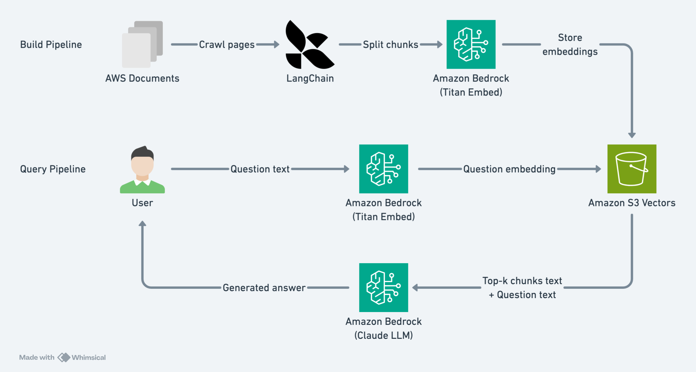

# Building a RAG Application with Amazon S3 Vectors and Amazon Bedrock

Retrieval-Augmented Generation (RAG) has become a foundational pattern for building AI applications that can answer questions using your own data. A typical RAG pipeline involves converting documents into vector embeddings, storing them in a vector database, and retrieving the most relevant chunks at query time to augment a large language model (LLM) prompt.

One of the key decisions when building a RAG application is choosing a vector database. Options range from fully managed services like Amazon OpenSearch Serverless to local libraries like FAISS. Each comes with trade-offs in cost, complexity, and operational overhead.

With the launch of **Amazon S3 Vectors**, you now have a purpose-built, cost-optimized option for vector storage that requires no infrastructure provisioning. In this post, we walk through building a complete RAG pipeline using S3 Vectors for storage and Amazon Bedrock for embeddings and text generation.

## What is Amazon S3 Vectors?

Amazon S3 Vectors delivers purpose-built, cost-optimized vector storage for AI agents, inference, RAG, and semantic search. It is designed to provide the same elasticity, durability, and availability as Amazon S3, with subsecond latency for similarity queries.

S3 Vectors consists of three key components:

- **Vector buckets** – A new bucket type purpose-built to store and query vectors.
- **Vector indexes** – Within a vector bucket, you organize your vector data within vector indexes and perform similarity queries against them.
- **Vectors** – Numerical representations (embeddings) stored in a vector index, with optional metadata for filtering.

Key features that make S3 Vectors well-suited for RAG workloads:

- **Serverless** – No infrastructure to provision or manage. You only pay for what you use.
- **Strongly consistent writes** – Newly added vectors are immediately available for queries.
- **Auto-optimization** – S3 Vectors automatically optimizes data over time for the best price-performance.
- **Metadata filtering** – Attach key-value metadata to vectors and filter query results by attributes like source, category, or timestamp.
- **AWS integration** – Works with Amazon Bedrock Knowledge Bases, Amazon OpenSearch Service, and Amazon SageMaker Unified Studio.

## Solution overview

We build a RAG pipeline that answers questions about the Amazon S3 User Guide documentation. As shown in the following diagram, the solution consists of two main pipelines:

- **Build Pipeline** – Crawl documentation pages from the AWS website, split them into chunks, generate embeddings with Amazon Bedrock Titan Embed, and store them in Amazon S3 Vectors
- **Query Pipeline** – Embed a user's question, retrieve the most similar document chunks from S3 Vectors, and generate a natural language answer with Amazon Bedrock Claude



### Services used

| Service | Purpose |
|---------|---------|
| Amazon S3 Vectors | Vector storage and similarity search |
| Amazon Bedrock (Titan Embed Text v2) | Generate 1024-dimensional vector embeddings |
| Amazon Bedrock (Claude 3 Haiku) | Generate natural language answers |

## Prerequisites

Before getting started, make sure you have:

- An AWS account with access to Amazon Bedrock models (Titan Embed Text v2 and Claude 3 Haiku) in `us-east-1`
- Python 3.10+ with `boto3` and `langchain-text-splitters` installed
- AWS credentials configured (via IAM role, environment variables, or AWS CLI)

```bash
pip install boto3 langchain-text-splitters langchain-community
```

## Configuration

We start by setting up the AWS clients and defining our configuration constants. Update the following constants to match your environment:

```python
import boto3
import json
import hashlib
import pickle
from langchain_text_splitters import RecursiveCharacterTextSplitter

# Configuration
REGION = "us-east-1"
VECTOR_BUCKET = "s3-doc-helper-vectors"            # S3 Vectors bucket name
VECTOR_INDEX = "s3-docs"                           # S3 Vectors index name
EMBEDDING_MODEL = "amazon.titan-embed-text-v2:0"   # Bedrock embedding model
LLM_MODEL = "anthropic.claude-3-haiku-20240307-v1:0"  # Bedrock LLM

# AWS clients
s3v = boto3.client("s3vectors", region_name=REGION)
bedrock = boto3.client("bedrock-runtime", region_name=REGION)
```

## Step 1: Build the vector index

This step covers the entire Build Pipeline: crawling documentation, splitting into chunks, generating embeddings, and storing them in S3 Vectors.

### 1a. Crawl documentation

First, we collect the source documents. We use LangChain's `SitemapLoader` to crawl all pages from the Amazon S3 User Guide sitemap and cache them locally:

```python
from langchain_community.document_loaders import SitemapLoader

def crawl():
    loader = SitemapLoader(
        web_path="https://docs.aws.amazon.com/AmazonS3/latest/userguide/sitemap.xml",
        requests_per_second=2,
    )
    docs = loader.load()

    with open("s3_docs.pkl", "wb") as f:
        pickle.dump(docs, f)
    print(f"Crawled {len(docs)} pages")
```

This fetches several hundred documentation pages. We save them as a pickle file so we only need to crawl once. Subsequent pipeline runs load from the local cache.

### 1b. Create the vector store

First, we create a vector bucket and a vector index. The `dimension` parameter must match the output of our embedding model (1024 for Titan Embed Text v2):

```python
def create_vector_store():
    try:
        s3v.create_vector_bucket(vectorBucketName=VECTOR_BUCKET)
        print(f"Created vector bucket: {VECTOR_BUCKET}")
    except s3v.exceptions.ConflictException:
        print(f"Vector bucket already exists: {VECTOR_BUCKET}")

    try:
        s3v.create_index(
            vectorBucketName=VECTOR_BUCKET,
            indexName=VECTOR_INDEX,
            dataType="float32",
            dimension=1024,
            distanceMetric="cosine",
        )
        print(f"Created vector index: {VECTOR_INDEX}")
    except s3v.exceptions.ConflictException:
        print(f"Vector index already exists: {VECTOR_INDEX}")
```

Both operations are idempotent — if the resources already exist, we catch the `ConflictException` and continue.

### 1c. Generate embeddings

We call Amazon Bedrock's Titan Embed Text v2 model to convert text into a 1024-dimensional vector:

```python
def generate_embedding(text):
    resp = bedrock.invoke_model(
        modelId=EMBEDDING_MODEL,
        body=json.dumps({"inputText": text}),
        contentType="application/json",
        accept="application/json",
    )
    return json.loads(resp["body"].read())["embedding"]
```

### 1d. Split, embed, and store

Now we put it all together. We load the cached documents, split them into chunks using `RecursiveCharacterTextSplitter`, generate embeddings, and store them in S3 Vectors in batches:

```python
def build():
    create_vector_store()

    # Load cached documents
    with open("s3_docs.pkl", "rb") as f:
        docs = pickle.load(f)
    print(f"Loaded {len(docs)} documents")

    # Split into chunks
    splitter = RecursiveCharacterTextSplitter(chunk_size=1000, chunk_overlap=200)
    chunks = splitter.split_documents(docs)
    print(f"Split into {len(chunks)} chunks")

    # Embed and store in batches
    batch_size = 10
    for i in range(0, len(chunks), batch_size):
        batch = chunks[i : i + batch_size]

        vectors = []
        for chunk in batch:
            embedding = generate_embedding(chunk.page_content)
            vectors.append({
                "key": hashlib.md5(chunk.page_content.encode()).hexdigest(),
                "data": {"float32": embedding},
                "metadata": {
                    "source": chunk.metadata.get("source", ""),
                    "text": chunk.page_content[:1000],
                },
            })

        s3v.put_vectors(
            vectorBucketName=VECTOR_BUCKET,
            indexName=VECTOR_INDEX,
            vectors=vectors,
        )
        print(f"  Stored {i + len(batch)}/{len(chunks)} vectors")

    print("Build complete!")
```

A few things to note:

- **Idempotent writes**: We use an MD5 hash of the chunk content as the vector key. If you run `build` multiple times, the same content overwrites the existing record rather than creating duplicates.
- **Metadata**: We store the original text and source URL as metadata on each vector. This lets us retrieve the text at query time without a separate lookup.
- **Batch processing**: We process 10 chunks at a time, embedding each one and writing the batch to S3 Vectors with a single `put_vectors` call. This provides progress visibility and resilience — if the process fails midway, you can resume without re-processing everything.

## Step 2: Query with RAG

With the vector index built, we can now answer questions. The query flow has three sub-steps:

1. Embed the user's question using the same embedding model
2. Search S3 Vectors for the top-3 most similar document chunks
3. Send the retrieved context along with the question to Claude for answer generation

```python
def query(question):
    # 2a. Embed the question
    question_embedding = generate_embedding(question)

    # 2b. Search for similar document chunks
    results = s3v.query_vectors(
        vectorBucketName=VECTOR_BUCKET,
        indexName=VECTOR_INDEX,
        queryVector={"float32": question_embedding},
        topK=3,
        returnMetadata=True,
    )
    context = "\n\n".join(v["metadata"]["text"] for v in results["vectors"])

    # 2c. Send context + question to LLM
    resp = bedrock.invoke_model(
        modelId=LLM_MODEL,
        body=json.dumps({
            "anthropic_version": "bedrock-2023-05-31",
            "max_tokens": 1024,
            "messages": [{
                "role": "user",
                "content": (
                    f"You are a helpful assistant that answers questions about Amazon S3."
                    f"Answer the question based on the information below.\n\n"
                    f"{context}\n\n"
                    f"Question: {question}"
                ),
            }],
        }),
        contentType="application/json",
        accept="application/json",
    )
    answer = json.loads(resp["body"].read())["content"][0]["text"]

    print(f"Question: {question}")
    print(f"Answer:   {answer}")
```

The `query_vectors` API returns the most similar vectors based on cosine distance. Because we stored the original text in the metadata, we can directly construct the LLM prompt without an additional data lookup.

### Example output

```
$ python rag_s3vectors.py query "What is S3 Vectors?"

Question: What is S3 Vectors?
Answer:   Answer: S3 Vectors refer to a type of Amazon S3 bucket that is purpose-built to store and query vectors efficiently. The key points about S3 Vectors are:

1. S3 vector buckets are a specialized type of Amazon S3 bucket for storing and querying vector data. This includes storing vector embeddings for machine learning models, and performing similarity searches.

2. S3 vector buckets use dedicated API operations to write and query vector data efficiently, compared to general-purpose S3 buckets.

3. S3 vector buckets organize data using "vector indexes" - resources within the bucket that store and organize vector data for efficient similarity search. These indexes can be configured with specific dimensions, distance metrics, and metadata to optimize for the use case.

4. S3 vector buckets integrate with other AWS services like Amazon Bedrock and Amazon OpenSearch to enable advanced vector-based querying and search capabilities.

In summary, S3 Vectors refer to a specialized S3 bucket type purpose-built for efficiently storing and querying vector data, such as for machine learning applications that require fast similarity searches.
```

## Step 3: Cleanup

To avoid ongoing charges, delete the vector index and bucket when you're done:

```python
def cleanup():
    s3v.delete_index(vectorBucketName=VECTOR_BUCKET, indexName=VECTOR_INDEX)
    s3v.delete_vector_bucket(vectorBucketName=VECTOR_BUCKET)
    print("Cleaned up all S3 Vectors resources")
```

## When to use S3 Vectors vs. other options

| | S3 Vectors | OpenSearch Serverless | FAISS (local) |
|---|---|---|---|
| **Infrastructure** | Serverless, zero setup | Serverless, managed | Local, in-memory |
| **Cost** | Pay per use (storage + requests) | Higher baseline cost | Free |
| **Persistence** | Cloud-native, durable | Cloud-native, durable | Local files only |
| **Query latency** | Subsecond | Milliseconds | Microseconds |
| **Metadata filtering** | Yes | Yes (advanced) | No |
| **Best for** | Cost-sensitive RAG, infrequent queries | High-QPS production workloads | Prototyping, local development |

Choose **S3 Vectors** when you want a lightweight, cost-effective vector store without managing infrastructure. Choose **OpenSearch Serverless** when you need high query throughput, hybrid search (vector + keyword), or advanced filtering. Use **FAISS** for local prototyping and experimentation.

## Conclusion

In this post, we built a complete RAG pipeline using Amazon S3 Vectors and Amazon Bedrock. S3 Vectors provides a serverless, cost-optimized way to store and query vector embeddings — making it an excellent choice for RAG applications that don't require the full capabilities of a dedicated vector database. With just Boto3 and a few lines of code, you can build a fully functional RAG system without managing any vector database infrastructure.

The complete source code is available on [GitHub](https://github.com/your-repo-here).

### Taking it further

- **Add metadata filtering** — Filter query results by document source or category for more precise retrieval
- **Use Bedrock Knowledge Bases with S3 Vectors** — If you don't need a custom pipeline, Amazon Bedrock Knowledge Bases can handle document splitting, embedding, storage, and retrieval automatically. Simply upload your documents to an S3 bucket, select S3 Vectors as the vector store when creating a Knowledge Base, and use the RetrieveAndGenerate API to query — no custom code required.
- **Scale up** — Use Bedrock Batch Inference for large-scale embedding generation

---

*The sample code in this post is provided for demonstration purposes and is not intended for production use without additional error handling, security review, and testing. Using the AWS services described in this post may incur charges to your AWS account. See [Amazon S3 pricing](https://aws.amazon.com/s3/pricing/) and [Amazon Bedrock pricing](https://aws.amazon.com/bedrock/pricing/) for details.*

## References

- [Working with S3 Vectors and vector buckets](https://docs.aws.amazon.com/AmazonS3/latest/userguide/s3-vectors.html) – Official documentation for Amazon S3 Vectors, including features, use cases, and API overview
- [Tutorial: Getting started with S3 Vectors](https://docs.aws.amazon.com/AmazonS3/latest/userguide/s3-vectors-getting-started.html) – Step-by-step tutorial for creating vector buckets, indexes, and performing similarity queries
- [Using S3 Vectors with Amazon Bedrock Knowledge Bases](https://docs.aws.amazon.com/AmazonS3/latest/userguide/s3-vectors-bedrock-kb.html) – Guide for integrating S3 Vectors as a vector store for fully managed RAG with Bedrock Knowledge Bases
- [How Amazon Bedrock Knowledge Bases work](https://docs.aws.amazon.com/bedrock/latest/userguide/kb-how-it-works.html) – Overview of the managed RAG workflow in Amazon Bedrock
- [Amazon Titan Text Embeddings models](https://docs.aws.amazon.com/bedrock/latest/userguide/titan-embedding-models.html) – Documentation for the Titan Embed Text v2 model used in this post
- [Choosing an AWS vector database for RAG use cases](https://docs.aws.amazon.com/prescriptive-guidance/latest/choosing-an-aws-vector-database-for-rag-use-cases/introduction.html) – AWS Prescriptive Guidance for comparing vector database options on AWS
- [Amazon S3 pricing](https://aws.amazon.com/s3/pricing/) – Pricing details for S3 Vectors storage and requests
- [Amazon Bedrock pricing](https://aws.amazon.com/bedrock/pricing/) – Pricing details for embedding and LLM inference
